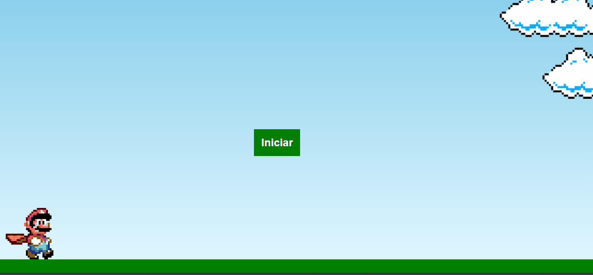

# 🍄👾🔥 Jogo do Mário

Um projeto de um jogo, desenvolvido para aprofundar minhas habilidades com JavaScript. O objetivo é apresentar funcionalidades interativas e um design atrativo utilizando **HTML**, **CSS** e **JavaScript**.  

---

## 🛠️ Tecnologias Utilizadas

- **HTML5** para estruturação do site.
- **CSS3** para estilização e responsividade.
- **JavaScript** para interatividade e funcionalidades.

---
